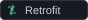
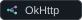
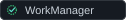
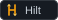
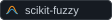
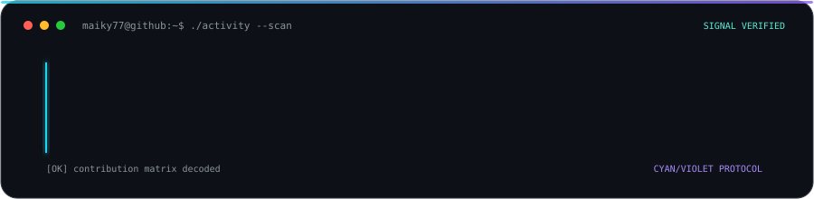

  

  
  
  

  

<h2 align="center">
  
  Sobre mí
</h2>

  Estudiante de Ingeniería Estadística e Informática. 
  Algunas ideas terminan en apuntes; otras terminan aquí. 
  🎮 Videojuegos &nbsp;·&nbsp; 🎬 Anime &nbsp;·&nbsp; 🎧 Música

<table>
  <tr>
    <td width="33.33%" align="center" valign="top">
       
      <strong>BUILD</strong> 
      <small>Desarrollo full-stack y móvil</small>
      
Plataformas web, APIs, autenticación, paneles, bases de datos y aplicaciones Android nativas.

    </td>
    <td width="33.33%" align="center" valign="top">
       
      <strong>ANALYZE</strong> 
      <small>Estadística y aprendizaje automático</small>
      
Análisis de datos reales, clasificación, predicción y evaluación de modelos.

    </td>
    <td width="33.33%" align="center" valign="top">
       
      <strong>SOLVE</strong> 
      <small>IA aplicada y optimización</small>
      
Asistentes RAG, bases de datos vectoriales, visión por computadora y optimización con restricciones reales.

    </td>
  </tr>
</table>

  

<h2 align="center">
  
  Essential Stack
</h2>

<table align="center" width="840">
  <tr>
    <td width="420" align="center" valign="middle">
      <strong>Lenguajes</strong> 
      &nbsp;<small><small>Python</small></small>&ensp;
      &nbsp;<small><small>JavaScript</small></small>&ensp;
      &nbsp;<small><small>TypeScript</small></small> 
      &nbsp;<small><small>C++</small></small>&ensp;
      &nbsp;<small><small>R</small></small>&ensp;
      &nbsp;<small><small>PHP</small></small>&ensp;
      &nbsp;<small><small>SQL</small></small>
    </td>
    <td width="420" align="center" valign="middle">
      <strong>Desarrollo frontend</strong> 
      &nbsp;<small><small>React</small></small>&ensp;
      &nbsp;<small><small>Next.js</small></small>&ensp;
      &nbsp;<small><small>Vite</small></small> 
      &nbsp;<small><small>HTML</small></small>&ensp;
      &nbsp;<small><small>CSS</small></small>&ensp;
      &nbsp;<small><small>Tailwind CSS</small></small>
    </td>
  </tr>
  <tr>
    <td width="420" align="center" valign="middle">
      <strong>Desarrollo backend</strong> 
      &nbsp;<small><small>Node.js</small></small>&ensp;
      &nbsp;<small><small>NestJS</small></small>&ensp;
      &nbsp;<small><small>Express</small></small> 
      &nbsp;<small><small>Django</small></small>&ensp;
      &nbsp;<small><small>Django REST</small></small>&ensp;
      &nbsp;<small><small>Flask</small></small>
    </td>
    <td width="420" align="center" valign="middle">
      <strong>Desarrollo móvil</strong> 
      &nbsp;<small><small>Kotlin</small></small>&ensp;
      &nbsp;<small><small>Jetpack Compose</small></small> 
      &nbsp;<small><small>CameraX</small></small>&ensp;
      &nbsp;<small><small>ML Kit</small></small>&ensp;
      &nbsp;<small><small>Room</small></small>
    </td>
  </tr>
  <tr>
    <td width="420" align="center" valign="middle">
      <strong>Bases de datos</strong> 
      &nbsp;<small><small>MySQL</small></small>&ensp;
      &nbsp;<small><small>PostgreSQL</small></small>&ensp;
      &nbsp;<small><small>SQLite</small></small> 
      &nbsp;<small><small>Supabase</small></small>&ensp;
      &nbsp;<small><small>Qdrant</small></small>
    </td>
    <td width="420" align="center" valign="middle">
      <strong>Ciencia de datos y ML</strong> 
      &nbsp;<small><small>TensorFlow / Keras</small></small>&ensp;
      &nbsp;<small><small>NumPy</small></small> 
      &nbsp;<small><small>Pandas</small></small>&ensp;
      &nbsp;<small><small>Scikit-learn</small></small>&ensp;
      &nbsp;<small><small>seaborn</small></small>
    </td>
  </tr>
  <tr>
    <td colspan="2" align="center" valign="middle">
      <strong>IA aplicada y optimización</strong> 
      &nbsp;<small><small>OpenCV</small></small>&ensp;
      &nbsp;<small><small>face_recognition</small></small>&ensp;
      &nbsp;<small><small>LangChain</small></small>&ensp;
      &nbsp;<small><small>OR-Tools</small></small>
    </td>
  </tr>
  <tr>
    <td colspan="2" align="center" valign="middle">
      <strong>Herramientas</strong> 
      &nbsp;<small><small>Docker</small></small>&ensp;
      &nbsp;<small><small>Git</small></small>&ensp;
      &nbsp;<small><small>Jupyter</small></small>
    </td>
  </tr>
</table>

<h2 align="center">
  
  Additional
</h2>

  <strong>Lenguajes y web</strong> 
  &nbsp;
  &nbsp;
  &nbsp;
  

  <strong>Ecosistema Android</strong> 
  &nbsp;
  &nbsp;
  &nbsp;
  &nbsp;
  

  <strong>Data e IA especializada</strong> 
  &nbsp;
  &nbsp;
  &nbsp;
  

  

  

  <em>The rest is still in development.</em>

